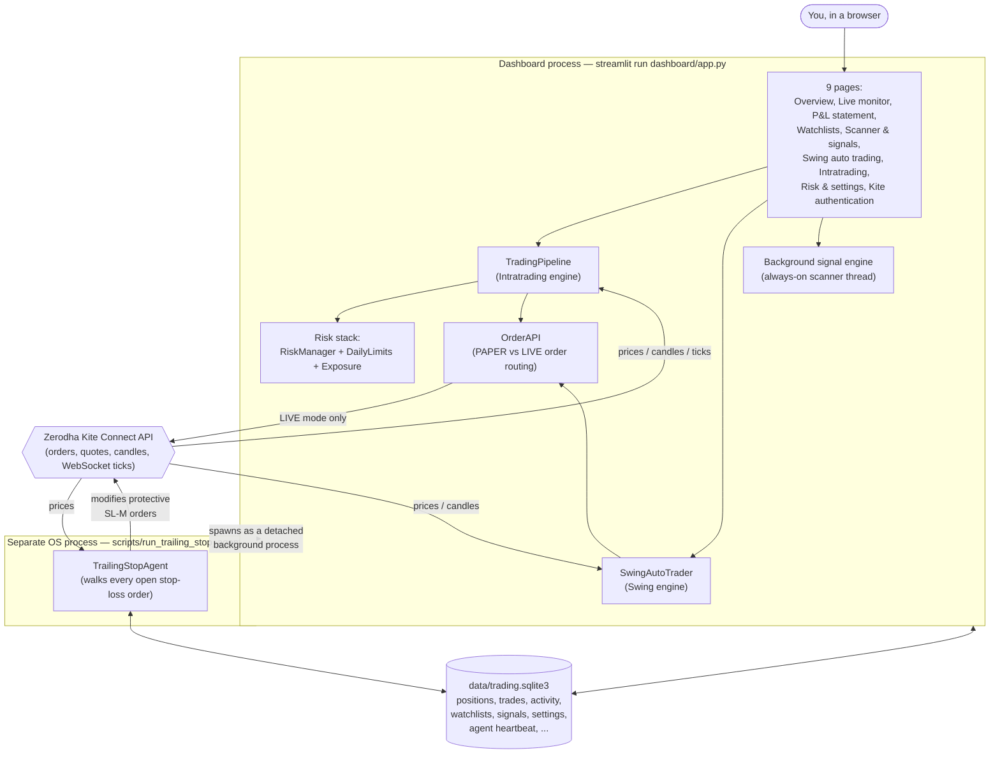
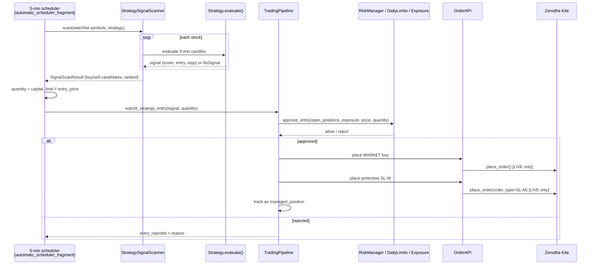

# Garuda Trading Solution — Full Documentation

**Status: living document.** This file is meant to be updated every time the system changes in a meaningful way — new strategy, new page, new settings, a rule that changed. If you're an AI assistant working on this repo: after finishing a feature or fix that changes behavior described below, update the relevant section here in the same session, and add a line to the [Changelog](#14-changelog--iteration-log) at the bottom. Don't wait to be asked twice.

**Last updated:** 2026-09-14

---

## Table of contents

1. [What is this, in plain English](#1-what-is-this-in-plain-english)
2. [Who's who — the moving parts](#2-whos-who--the-moving-parts)
3. [Architecture at a glance](#3-architecture-at-a-glance)
4. [How a trade actually happens, step by step](#4-how-a-trade-actually-happens-step-by-step)
5. [The dashboard, page by page](#5-the-dashboard-page-by-page)
6. [The trading strategies](#6-the-trading-strategies)
7. [Risk & safety controls](#7-risk--safety-controls)
8. [Settings reference](#8-settings-reference)
9. [Data & persistence](#9-data--persistence)
10. [Background processes](#10-background-processes)
11. [Project structure](#11-project-structure)
12. [Known gaps, inconsistencies, and dead code](#12-known-gaps-inconsistencies-and-dead-code)
13. [Glossary of trading terms](#13-glossary-of-trading-terms)
14. [Changelog / iteration log](#14-changelog--iteration-log)

---

## 1. What is this, in plain English

Imagine you want to buy and sell stocks automatically, using rules instead of gut feeling, through your own Zerodha account — but you also want a dashboard where you can watch everything happening, turn things on/off, and never lose track of what you own.

That's what this project is. In plain terms, it's four things stitched together:

1. **A watchlist manager** — you tell it which stocks you care about (e.g. "everything in NIFTY 500" or a hand-picked list).
2. **A set of "if this, then that" trading rules** ("strategies") — e.g. *"if a stock's short-term average price crosses above its long-term average, and volume is unusually high, buy it."* There are about 14 of these rules built in, each suited to a different style of trading (fast intraday trades vs. multi-day swing trades).
3. **An order-placing robot** — once a rule says "buy," this part actually places the order with your broker (Zerodha), either for real money (**LIVE** mode) or as a practice/simulation with fake money (**PAPER** mode) so you can test safely first.
4. **A safety net** — a separate, always-running background process whose only job is to watch every open position and keep nudging its stop-loss order upward as the price rises, so profits get locked in and losses get capped, even if you close your laptop.

All of this is controlled from one web page (the "dashboard"), built with a tool called Streamlit, that you open in your browser.

**Two "flavours" of automatic trading are offered, side by side:**

- **Intratrading** — fast, same-day trades. Buys and sells within the trading day, never holds overnight.
- **Swing auto trading** — slower, multi-day trades. Buys and holds for several days to weeks, looking for bigger trend moves.

Both flavours share the same underlying safety rules (position size limits, daily trade limits) but run independently, with their own settings and their own on/off switches.

**Nothing happens by accident.** The system defaults to PAPER mode (fake money). To place real orders, you must explicitly switch to LIVE mode *and* tick an "I understand this places real orders" confirmation box on each auto-trading page. There's also a big red "Emergency stop" button that instantly blocks all new trades, on every page.

---

## 2. Who's who — the moving parts

A quick cast of characters, in plain language, before the technical detail:

| Name | What it is, in one sentence |
|---|---|
| **The Dashboard** | The web page you interact with (`streamlit run dashboard/app.py`). One process, many pages. |
| **Zerodha / Kite Connect** | Your actual stockbroker and the API it exposes for programs to place orders, read prices, and check positions. |
| **TradingPipeline** | The engine behind **Intratrading** — turns live price ticks into candles, candles into signals, signals into orders, and watches positions until they close. |
| **SwingAutoTrader** | The engine behind **Swing auto trading** — scans once-a-day candles, decides which stocks qualify, and places CNC (delivery) orders. |
| **The Signal Engine** | A separate always-on background scanner (started/stopped from the "Scanner & signals" page) that just *finds and records* signals — it does not place orders itself. |
| **The Trailing-Stop Agent** | A completely separate program (its own OS process, not just a browser tab) whose only job is to keep every open position's protective stop-loss order up to date at the broker, in real time, whether or not the dashboard is even open. |
| **The Risk Stack** | Three small rulebooks — max open positions, max trades per day, max % of capital deployed — that every automatic order must pass before it's allowed through. |
| **The Database** | One SQLite file (`data/trading.sqlite3`) that remembers everything: open positions, trade history, watchlists, settings, activity logs — so nothing is lost if you close the dashboard. |

---

## 3. Architecture at a glance



**Why a separate process for the trailing stop?** Zerodha's order API has no built-in "trailing stop" order type — you have to keep re-submitting a new stop price yourself as the market moves. If that logic lived only inside the dashboard's browser tab, closing the tab (or your laptop lid) would stop it, leaving real open positions unprotected. So it's built as an independent, detached OS process that keeps running in the background regardless of whether the dashboard is open — see [§10](#10-background-processes).

**Why two separate "auto-trading engines" (TradingPipeline vs SwingAutoTrader) instead of one?** They operate on fundamentally different rhythms — Intratrading reacts to live tick-by-tick prices within one day, Swing only ever looks at yesterday's finished daily candle. Rather than force one engine to do both, they're independent, each with its own position list, its own settings, and its own on/off switch — but they share the same order-placing plumbing (`OrderAPI`) and the same database.

---

## 4. How a trade actually happens, step by step

### 4.1 Intratrading (same-day trades) — layman version

1. Every 5 minutes (while armed), the dashboard looks at every stock in your selected watchlist(s).
2. For each stock, it checks the chosen strategy's rule (e.g. "did price just break above a key level with strong volume?").
3. Stocks that pass become "candidates," ranked by a score (0–100).
4. For each candidate, the system works out how many shares it can afford: **your configured rupee cap ÷ the stock's price**.
5. It checks the safety net (see [§7](#7-risk--safety-controls)) — are we already at the max number of open positions? Have we hit today's trade limit? Would this push total capital deployed over the limit? If any answer is "yes," the order is rejected, not silently ignored — you'll see why in the activity log.
6. If everything passes, a real (or simulated) **MARKET order** is placed to buy the stock.
7. From then on, every 5 seconds, the dashboard checks whether a profit target has been hit (if so, it exits immediately) — the actual trailing stop-loss is not this page's job; that's handled continuously by the separate Trailing-Stop Agent (§10).
8. At the configured "Force exit" time, any Intratrading position still open gets closed automatically — these trades never hold overnight.

### 4.2 Swing auto trading (multi-day trades) — layman version

1. Once a day (or on manual demand), the scanner looks at the previous day's completed candle for every stock in your watchlist.
2. It checks a slower rule (e.g. "did the 9-day average price just cross above the 200-day average?").
3. Qualifying stocks become candidates.
4. Position size = **your configured rupee cap ÷ price**, capped further by a maximum share count you set.
5. If the position-count safety limit hasn't been reached, and you're in LIVE mode with the confirmation box ticked, a **CNC (delivery) BUY order** is placed, plus a protective **SL-M (stop-loss market) sell order** at the broker.
6. The position is then held for days — the Trailing-Stop Agent (§10) keeps walking that protective stop upward as the price rises, once a day, using the daily candle.
7. The position closes either when the trailing stop is eventually hit (the broker fills the SL-M order) or when you manually close it.

### 4.3 The technical version (sequence diagram, Intratrading)



---

## 5. The dashboard, page by page

The sidebar is branded **"ART Trading Solutions"** and lists 9 pages (only "Kite authentication" is visible until you've logged in):

### 5.1 Kite authentication
The front door. Walks you through Zerodha's login flow: click a link, log into Zerodha in a new tab, get redirected back with a temporary code, exchange it here for a day-valid access token. Also has a toggle to auto-start the Trailing-Stop Agent every time you log in, and a "Log out" button. Every other page is locked until this step is done.

### 5.2 Overview
The home/command-center page: today's P&L, simulated equity, win rate, how many positions are open vs. your max, a daily ledger, an equity chart, and the "Emergency stop" kill-switch. Also lets you reconcile what the dashboard *thinks* is open against what Zerodha *actually* shows (LIVE mode only) — useful for catching drift.

### 5.3 Live monitor
A read-only, database-backed view of every **LIVE-mode** position (both Intratrading and Swing), refreshed every 10 seconds, cross-checked against Zerodha's own live broker positions. Shows the Trailing-Stop Agent's health (is it running? when did it last check in?) with a "Start agent now" button if it's not.

### 5.4 P&L statement
One combined table of every open (unrealized) and closed (realized) trade — a simple exportable-style ledger, filterable by Open/Closed/All.

### 5.5 Watchlists
Where you define *which stocks the whole system pays attention to*. Create named lists, search and add stocks individually or in bulk (paste a list, or import an entire index like NIFTY 500), mark which lists are "active" (used for scanning), and view/manage each list's contents. Also has a "Dynamic Watchlist" sub-feature that auto-filters a source list by an early-morning breakout rule and refreshes itself on a schedule.

### 5.6 Scanner & signals
Controls the **always-on background signal engine** — a separate scanning loop (distinct from the two auto-trading engines) that continuously looks for signals across your watchlists and just *records* them (it never places orders). You pick one of five "live strategies," start/stop the engine, and watch a live health banner. Also has a one-off "Historical day scan" tool to replay any single past trading day against a chosen strategy.

### 5.7 Backtesting
The research-only replay page uses Kite Connect historical candles and requires a valid Kite access token. Select one symbol or the active watchlists, choose a strategy and Daily or 5-minute candles, set the date range, fees, slippage, and sizing, then run the replay. Results include aggregate and per-symbol metrics, an equity curve, exit reasons, and downloadable trades. The page never submits orders, writes trading activity, or changes live positions.

The page supports the Scanner & signals, Intratrading, and Swing auto trading strategies. EMA 9/200 progressive backtests enter only when the lifecycle reaches STRONG; LIGHT remains lifecycle context and EMA9 <= EMA200 invalidates the cycle. Swing trend breakout candidates require the same next-session confirmation used by the live page. If Kite cannot return data for a symbol or date range, that symbol is reported separately and successful symbols still finish.

### 5.8 Swing auto trading
See [§4.2](#42-swing-auto-trading-multi-day-trades--layman-version). UI: a strategy dropdown, a live-order confirmation checkbox, a "Trading Live Start/End" toggle, a manual "Scan" button, a live progress bar during scanning, a color-coded engine-health banner, a rolling "Recent scan cycles" log, a "Recent swing activity" log, and a results table of qualifying candidates plus a table of currently-open swing positions.

### 5.9 Intratrading
See [§4.1](#41-intratrading-same-day-trades--layman-version). Same UX pattern as Swing (confirmation checkbox, Start/End toggle, Scan button, progress bar, health banner, cycle log, activity log), plus an embedded live position monitor that checks for profit-target exits every 5 seconds.

### 5.10 Risk & settings
The one settings page. Three sections, saved together:
- **Global** — Trading mode (PAPER/LIVE), Initial capital, Maximum capital deployment %.
- **Intratrading** — Maximum capital per position, Maximum open positions, Trailing stop ATR multiplier, Maximum trades per day, Market open/Entry window/Force exit times.
- **Swing auto trading** — Maximum capital per position, Maximum quantity per position, Trailing stop ATR multiplier, Maximum open swing positions.

Settings persist to the database, so they survive a dashboard restart. If you change settings while positions are open, those existing positions keep running on their *old* settings until they close — a warning banner says so.

---

## 6. The trading strategies

| Strategy | One-line rule | Used by |
|---|---|---|
| VWAP EMA breakout *(current/default)* | Weighted 10-factor score (price vs VWAP, EMA20>50>100>200 stack, 20-bar breakout, volume, RSI, ADX, optional market-regime filter); needs score ≥ 80 | Intratrading |
| High-conviction long | Hard gates (new 20-bar high, volume ≥1.5×, above VWAP) + weighted score ≥ 85; stop = 1×ATR; targets +1%/+2% | Intratrading (default selection) |
| Pre-Spike Momentum | Detects early bullish momentum before a bigger move (RVOL, price change, breakout, EMA alignment, volume build-up, range compression), scored 0–100 | Intratrading, Scanner & signals |
| Previous day high breakout | BUY when price closes above yesterday's high | Intratrading, Scanner & signals, historical day scan |
| EMA 200 close-above | BUY when a candle closes above its 200-period EMA | Scanner & signals, historical day scan |
| EMA 9/200 progressive | Stateful multi-stage alert tracker (LIGHT → STRONG → INVALIDATED/WEAKENED) — records alerts, does not place orders | Scanner & signals (always-on engine) |
| EMA 9/200 swing | BUY on a *fresh* daily EMA9-crosses-above-EMA200 | Swing auto trading, historical day scan |
| Trend breakout (next-session confirmation) | Two-stage: flags a breakout candidate one day, only confirms/enters if the *next* day's close breaks above that candle's high | Swing auto trading |
| EMA trend (simple) | Configurable dual-EMA crossover or trend-alignment rule | Intratrading (simple preset), backtesting |
| Crossover | BUY on close-crosses-above-VWAP, SELL on close-crosses-below-EMA20 | Demo pipeline, backtesting |
| ATR momentum | BUY/SELL if candle range exceeds a multiple of ATR | Backtesting only |
| Opening range breakout | BUY/SELL on a break of the first N candles' high/low | Backtesting only |
| VWAP momentum | BUY/SELL on a confirmed VWAP cross | Backtesting only |
| EMA 200/20 confirmation | Two-candle confirmation pattern around EMA200/EMA20 crosses | Backtesting only |

---

## 7. Risk & safety controls

The risk system was recently simplified. **Per-trade risk percentage and a rupee-based daily-loss circuit breaker have been removed** — position sizing is now driven purely by a rupee capital cap per position (set per engine), and only three safety gates remain, checked on every single order:

| Gate | Rule | What happens if it fails |
|---|---|---|
| **Maximum open positions** | `open positions < max_open_positions` | New entry rejected — "too many positions already open" |
| **Maximum trades per day** | `trades today < max_trades_per_day` | New entry rejected for the rest of the day |
| **Maximum capital deployment** | `(current + new position value) ≤ capital × max_capital_deployment%` | New entry rejected — "would exceed capital deployment cap" |

Position **size** itself is computed as `configured rupee cap ÷ entry price` (per engine — Intratrading and Swing each have their own capital cap), then double-checked against the capital-deployment ceiling above as a final backstop.

**Two independent, non-shared position-count pools:** Intratrading's "Maximum open positions" and Swing's "Maximum open swing positions" are separate counters — filling one up does not affect the other's limit.

**Emergency stop:** available on the sidebar (always visible) and on the Overview page. Immediately blocks all new automatic entries across the whole app (not just one engine) until explicitly resumed. Existing open positions are *not* force-closed by this — it only stops *new* ones.

**Live-order confirmation gate:** both Intratrading and Swing require (a) Trading mode = LIVE and (b) a manually-ticked "I understand this can place real orders..." checkbox before their "Start" button becomes clickable — this resets every time you leave the page.

---

## 8. Settings reference

All settings live on the **Risk & settings** page and persist to the database (`dashboard_settings` table), so they survive a restart. Fields not listed here (API keys, Telegram config, etc.) come from the `.env` file and aren't editable from the UI.

| Field | Default | Section | Purpose |
|---|---|---|---|
| Trading mode | PAPER | Global | Master switch: PAPER (simulated) vs LIVE (real broker orders) |
| Initial capital | ₹100,000 | Global | Baseline equity for sizing/reporting |
| Maximum capital deployment (%) | 80% | Global | Ceiling on total capital tied up in open positions at once |
| Maximum capital per position (Intratrading) | ₹5,000 | Intratrading | Rupee cap used to size each automatic intraday entry |
| Maximum open positions | 3 | Intratrading | Concurrent open Intratrading position cap |
| Trailing stop ATR multiplier | 1.5 | Intratrading | How far behind price the intraday trailing stop trails (× ATR) |
| Maximum trades per day | 5 | Intratrading | Daily new-trade throttle |
| Market open | 09:15 | Intratrading | Session open reference time |
| Entry window start | 09:20 | Intratrading | Earliest time new Intratrading entries are allowed |
| Entry window end | 14:45 | Intratrading | Latest time new Intratrading entries are allowed |
| Force exit | 15:15 | Intratrading | Time all Intratrading positions are force-closed |
| Maximum capital per position (Swing) | ₹2,000 | Swing | Rupee cap used to size each swing entry |
| Maximum quantity per position (Swing) | 1 share | Swing | Hard share-count cap, on top of the capital cap |
| Trailing stop ATR multiplier (Swing) | 2.0 | Swing | How far behind price the swing trailing stop trails (× ATR) |
| Maximum open swing positions | 10 | Swing | Concurrent open Swing position cap — scanning pauses once reached |

---

## 9. Data & persistence

Everything is stored in one SQLite file: **`data/trading.sqlite3`**. No external database server — it's a single file on disk, safe to back up by copying it.

Key tables (accessed exclusively through `app/database/repository.py`'s `Repository` class — nothing talks to SQL directly elsewhere):

| Table | Holds |
|---|---|
| `positions` | Every currently-open position (Intratrading + Swing), including the broker's protective stop order id |
| `trades` | Every closed trade (entry/exit price, P&L, strategy, reason) |
| `orders` | A simple log of broker order submissions |
| `activity` | The detailed event ledger — every submit/reject/skip/exit event, across both engines, with a reason string |
| `watchlists` | Named user-defined stock lists |
| `dynamic_watchlists` | The one auto-filtered "Dynamic Watchlist" per user |
| `signals` | Signals recorded by the always-on background signal engine |
| `pre_spike_events` | Lifecycle tracking for the Pre-Spike Momentum strategy |
| `ema_progressive_cycles` | Lifecycle tracking for the EMA 9/200 progressive alert strategy |
| `notifications` | Telegram/UI notification log, deduplicated |
| `dashboard_settings` | The persisted Risk & settings values, one row per user |
| `agent_heartbeat` | Liveness/crash signal for background processes (e.g. the Trailing-Stop Agent) |
| `strategy_presets` | User-saved custom strategy parameter sets |

The database has a hand-rolled, idempotent migration system: on every startup it runs `CREATE TABLE IF NOT EXISTS` for all tables, then a series of "add this column if it's missing" checks — safe to run every single time the app starts, no separate migration step needed.

---

## 10. Background processes

Two things run independently of whichever dashboard page you happen to be looking at:

### 10.1 The always-on Signal Engine
Started/stopped from the **Scanner & signals** page. Runs inside the same dashboard process (a background thread), continuously scanning your selected watchlists for whichever "live strategy" you picked, and saving signals to the database. It does **not** place any orders — it's purely a detector/recorder. Its heartbeat is shown as a health banner on that page.

### 10.2 The Trailing-Stop Agent
Launched as a **fully separate operating-system process** (`scripts/run_trailing_stop_agent.py`), detached from the dashboard so it survives closing the browser or even the Streamlit server. Its only job: for every open **LIVE-mode** position (Intratrading or Swing), keep walking that position's protective stop-loss order at Zerodha upward as price moves favorably (Zerodha's API has no built-in trailing-stop order type, so this replaces it). It checks in via a heartbeat row in the database every ~15 seconds; the dashboard watches that heartbeat and warns you if it goes stale (>90 seconds) or was never started. It can be auto-started every time you log in (toggle on the Kite authentication page), or started manually from the Live monitor / Kite authentication pages.

Swing positions get special handling: because Zerodha cancels "day" orders (including SL-M stops) at market close, the agent re-arms a fresh stop each morning for any swing position whose overnight stop order expired.

### 10.3 The standalone realtime runtime (optional, not part of the dashboard)
`scripts/run_paper_trading.py` / `app/execution/runtime.py` is a separate, WebSocket-driven pathway: it subscribes to Zerodha's live tick stream directly and feeds ticks straight into a `TradingPipeline` running a hardcoded strategy (VWAP EMA breakout), independent of anything happening in the dashboard. This is a headless alternative to opening the dashboard's Intratrading page — useful for a server deployment with no browser involved, but currently fixed to one strategy (no UI to change it).

---

## 11. Project structure

```
algo-trading/
├── README.md                # Original setup/quick-start doc (this file complements it)
├── DOCUMENTATION.md          # This file
├── requirements.txt
├── .env                      # Local secrets/config (API keys, not committed)
├── app/
│   ├── main.py                # `python -m app.main` entrypoint
│   ├── broker/                 # Kite Connect: auth, client, order placement, live market data, tick streaming
│   ├── config/                 # Settings (pydantic) + enums (TradingMode, SignalAction, Side)
│   ├── database/                # SQLite Database class, dataclass models, Repository (all DB access)
│   ├── execution/                # TradingPipeline, SwingAutoTrader, TrailingStopAgent, agent launcher, standalone runtime
│   ├── market/                    # Candle building, indicators (EMA/ATR/RSI/ADX/VWAP), the two scanners
│   ├── monitoring/                 # Notifications, health checks, the always-on signal engine
│   ├── risk/                        # RiskManager, DailyLimits, Exposure, position sizing
│   ├── scheduler/                    # Background job scheduling (APScheduler)
│   └── strategy/                      # 14 strategy modules + shared base classes
├── backtest/                # Bar-replay backtesting engine, metrics, optimizer, walk-forward split
├── dashboard/
│   └── app.py                 # The entire Streamlit UI (single large file, ~4,500 lines)
├── scripts/                  # CLI entrypoints: run_backtest, run_paper_trading, run_signal_engine, run_trailing_stop_agent, and two unimplemented data-download stubs
├── data/                     # trading.sqlite3 (the live database), raw/processed backtest data folders
├── logs/
└── tests/                    # 33 test modules (pytest)
```

---

## 12. Known gaps, inconsistencies, and dead code

Kept here on purpose, in plain sight, so future work doesn't rediscover the same surprises from scratch:

- **Dead page**: `render_automatic_feed` in `dashboard/app.py` defines a full "Automatic trading" page (reviews persisted signals, submits via a `CrossoverStrategy`), but it's never called from anywhere — superseded by today's Intratrading page and left in place unused.
- **CLI backtest remains separate**: `scripts/run_backtest.py` still accepts local OHLCV CSV input for reproducible command-line research; the dashboard Backtesting page intentionally uses Kite Connect only.
- **`SQLAlchemy` dependency is unused** — `requirements.txt` lists it, but the database layer uses raw `sqlite3` directly. Likely leftover from an earlier plan or reserved for future use.
- **Stale `.env` variables**: `RISK_PER_TRADE` and `MAX_DAILY_LOSS` (and historically the removed Intratrading quantity/entries-per-run settings) may still be defined in `.env` — they're silently ignored now (`extra="ignore"` on the Settings model), not an error, but worth cleaning up eventually.
- **`PositionRecord.trading_mode` default mismatch**: the Python dataclass defaults this field to `"PAPER"`, but the database column's own default is `'LIVE'`, and `Repository.load_positions()` falls back to `"LIVE"` for `None` values. Minor inconsistency, unlikely to bite in practice but worth knowing about if you ever see an unexpected trading_mode on an old row.
- **Two unimplemented stub scripts**: `scripts/download_historical_data.py` and `scripts/download_instruments.py` currently just raise `SystemExit` — they're placeholders, not working tools.
- **`app/execution/runtime.py` is hardcoded to one strategy** (VWAP EMA breakout) with no way to change it short of editing code — unlike every dashboard page, which lets you pick a strategy.

---

## 13. Glossary of trading terms

- **PAPER vs LIVE** — PAPER simulates orders locally with fake fills; LIVE sends real orders to Zerodha with real money.
- **CNC** — "Cash and Carry," Zerodha's order product type for delivery (multi-day-hold) trades — used by Swing.
- **MARKET order** — an order that executes immediately at whatever the current price is (used for Intratrading entries/exits).
- **SL-M** — "Stop-Loss Market" order: an order that sits inactive until price touches a trigger level, then fires as a market order — this is the protective stop-loss mechanism used everywhere in this system.
- **EMA** — Exponential Moving Average, a smoothed average price over N periods that reacts faster to recent price than a simple average.
- **ATR** — Average True Range, a measure of how much a stock typically moves in a period; used to size stop-loss distances proportionally to volatility.
- **VWAP** — Volume-Weighted Average Price, the average price a stock has traded at today, weighted by how much volume traded at each price.
- **RVOL** — Relative Volume, today's volume compared to what's typical for this time of day — a spike suggests unusual interest.
- **RSI / ADX** — momentum/trend-strength indicators used as secondary filters in some strategies.
- **Watchlist** — a named list of stocks the system is allowed to consider trading.
- **Signal** — the output of a strategy check: "buy this stock at this price, with this stop-loss."
- **Candidate** — a signal that has passed a scan and is now eligible for order submission.
- **Trailing stop** — a stop-loss that only ever moves in your favor (up for a long position) as price rises, locking in gains without capping upside.
- **Managed position** — a position the dashboard's in-memory engine (`TradingPipeline`/`SwingAutoTrader`) is actively tracking and will act on.
- **Heartbeat** — a small "I'm still alive" timestamp a background process writes regularly, so the dashboard can tell if it's crashed or stalled.

---

## 14. Changelog / iteration log

Newest first. Keep entries short — one line per change, dated.

- **2026-09-14** — Initial version of this documentation created, covering the full system as it stood after the recent risk-simplification and Intratrading/Swing UI-parity work (removal of per-trade risk % and daily-loss circuit breaker; Intratrading redesigned to mirror Swing's UX: progress bar, activity logs, capital-only sizing, watchlist-only universe).
